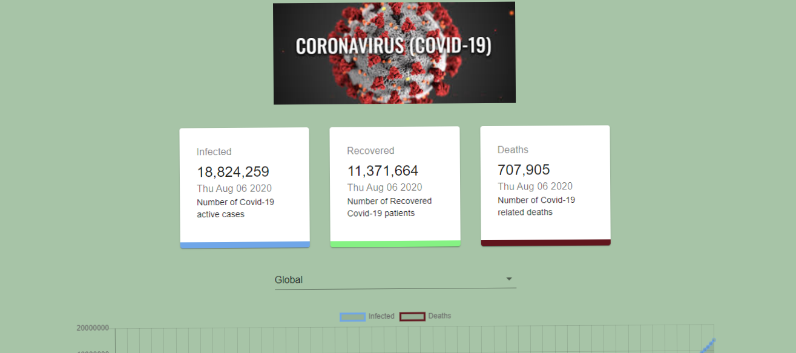

 

# Project Name

> Covid 19 Tracker

## Table of contents

- [General info](#general-info)
- [Technologies](#technologies)
- [How to run the app](#setup)
- [Status](#status)
- [How to improve the project](#how-to-improve-the-project)
- [Contact](#contact)

## General info

About
Users are able to track the number of people infected, recovered as well as deceased from the Covid-19 disease. The data used in this project was fetched from an open source external API. Real time app built with ReactJS, Material UI & ChartJS.

## Technologies

- @material-ui/core - version 4.11.0
- @testing-library/jest-dom- version 4.2.4
- @testing-library/react - version 9.5.0
- @testing-library/user-event - version 7.2.1
- axios - version 0.19.2
- chart.js - version 2.9.3
- classnames - version 2.2.6
- react - version 17.0.2
- react-chartjs-2 - version 2.9.0
- react-countup - version 4.3.3
- react-dom - version 17.0.2
- react-scripts - version 3.4.1
- enzyme - version3.11.0
- cypress - version 7.5.0

## How to run the app

2. Run:
   `npm install`,

   `npm start` **_to start the application_**,

   `npm test` **_to run unit test_**,

   `npx cypress run` **_to run integration test_**,

## Status

Project is:completed

## How to improve the project

- Star this repository
- Fork this repository
- Open any of the Javascriit file and add the explanation of any line of code as a comment line
- Commit changes with a meaningful commit message
- Create a pull request.
- Wait for your PR to be reviewed and merged.
